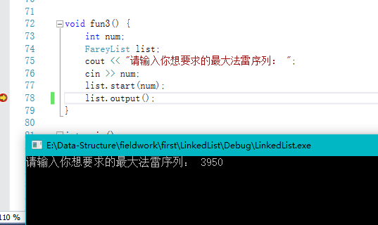
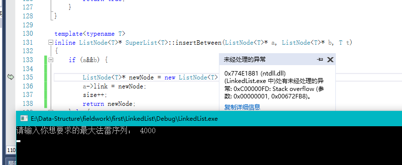
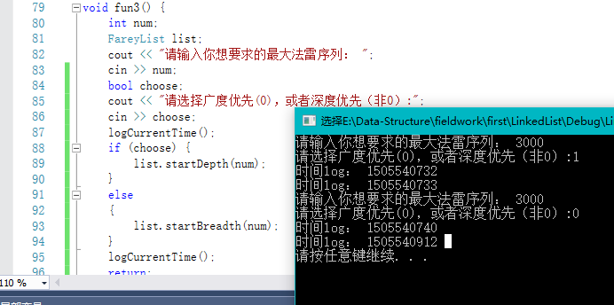
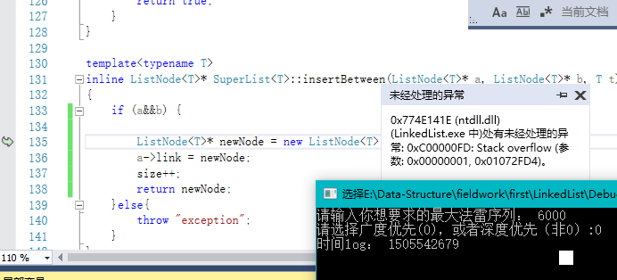

# 数据结构的各种实习

### 作业p84 2.6
实现了一个顺序表，一些基本功能，模板的

### 作业p86 2.15

* 类LinkedList
```cpp
struct Item{
    int date;
    Item* linked;
}
```
节点的单向链表
功能简单，归并，全部排序，增删该查


* 类SuperList，实现了实习一的关于链表的一些要求

```cpp
template<typename T>
struct ListNode {
	T date;
	ListNode* link;
    ....
};
```
各全模板，可自定义排序，通过传递函数指针
重载了排序函数 begin ,end, sortFun*;

##  实习一

### 关于法雷序列

#### 方案一：递归

##### 深度优先
在我的电脑上，大概3950-4000 之间的时候就开始栈溢出
```cpp
void FareyList::recursion(ListNode<Fraction>* a, ListNode<Fraction>* b)
{
	if ((a->date.d + b->date.d)> maxNum)
		return;
	ListNode<Fraction> *m = list.insertBetween(a, b, Fraction{ a->date.n + b->date.n,a->date.d + b->date.d });
	recursion(a, a->link);
	recursion(m, b);
}
```

-----


##### 广度优先
```cpp
void FareyList::recursion()
{
	ListNode<Fraction>* a = list.getFirst();
	ListNode<Fraction>* b = list.getFirst()->link;
	while (b)
	{
		if ((a->date.d + b->date.d) <= maxNum) {
			list.insertBetween(a, b, Fraction{ a->date.n + b->date.n,a->date.d + b->date.d });
			over = false;
		}
		a = b;
		b = b->link;
	}
	if (!over) {
		over = true;
		recursion();
	}
}
```



但是仍然崩溃，此时size=10938995


####总结： 法雷序列如果通过递归来进行搜索（？），那么无论是深度优先还是广度优先，选好终结条件是关键，另外，感觉深度优先递归（2的n次方？）的话更容易溢出，而广度优先由于递归的层数更少（递归层数？），更不容易溢出?但是，最终仍然会因为new的空间太大而不可以继续new


#### 方案二： 循环

待写
