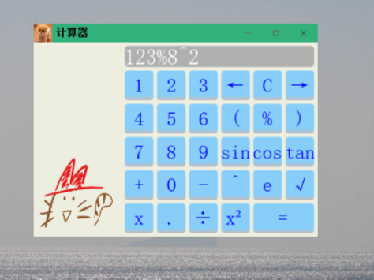

# 数据结构的各种实习

<!-- TOC depthFrom:1 depthTo:6 withLinks:1 updateOnSave:1 orderedList:0 -->

- [数据结构的各种实习](#数据结构的各种实习)
		- [作业p84 2.6](#作业p84-26)
		- [作业p86 2.15](#作业p86-215)
	- [实习一](#实习一)
		- [关于法雷序列](#关于法雷序列)
			- [方案一：递归](#方案一递归)
				- [深度优先](#深度优先)
				- [广度优先](#广度优先)
			- [方案二： 循环](#方案二-循环)
		- [关于大数阶乘](#关于大数阶乘)
	- [实习二](#实习二)
		- [实现一个计算器](#实现一个计算器)
		- [关于火车转运问题](#关于火车转运问题)

<!-- /TOC -->


### 作业p84 2.6
实现了一个顺序表，一些基本功能，模板的

### 作业p86 2.15

* 类LinkedList
```cpp
struct Item{
    int date;
    Item* linked;
}
```
节点的单向链表
功能简单，归并，全部排序，增删该查


* 类SuperList，实现了实习一的关于链表的一些要求

```cpp
template<typename T>
struct ListNode {
	T date;
	ListNode* link;
    ....
};
```
各全模板，可自定义排序，通过传递函数指针
重载了排序函数 begin ,end, sortFun*;

##  实习一

### 关于法雷序列

#### 方案一：递归

##### 深度优先
在我的电脑上，大概3950-4000 之间的时候就开始栈溢出
```cpp
void FareyList::recursion(ListNode<Fraction>* a, ListNode<Fraction>* b)
{
	if ((a->date.d + b->date.d)> maxNum)
		return;
	ListNode<Fraction> *m = list.insertBetween(a, b, Fraction{ a->date.n + b->date.n,a->date.d + b->date.d });
	recursion(a, a->link);
	recursion(m, b);
}
```

-----


##### 广度优先
```cpp
void FareyList::recursion()
{
	ListNode<Fraction>* a = list.getFirst();
	ListNode<Fraction>* b = list.getFirst()->link;
	while (b)
	{
		if ((a->date.d + b->date.d) <= maxNum) {
			list.insertBetween(a, b, Fraction{ a->date.n + b->date.n,a->date.d + b->date.d });
			over = false;
		}
		a = b;
		b = b->link;
	}
	if (!over) {
		over = true;
		recursion();
	}
}
```


但是仍然崩溃，此时size=10938995


> 总结： 法雷序列如果通过递归来进行搜索（？），那么无论是深度优先还是广度优先，选好终结条件是关键，另外，感觉深度优先递归（2的n次方？）的话更容易溢出，而广度优先由于递归的层数更少（递归层数？），更不容易溢出?但是，最终仍然会因为new的空间太大而不可以继续new


#### 方案二： 循环
--------
>17.9.22更新

迭代计算法：参考了acm相关论文的一种方法

> 法雷序列有个比较明显，基本上也是众所周知的性质，对于法雷序列中的任意三个连续的分数，设为p1/q1, p2/q2, p3/q3, 应该有性质:p2/q2 = (p1+p3)/(q1+q2)，其中p2,q2可能是经过约分得到的。如此我们希望通过已知的前两个数，直接能得到第三个数，然后依次类推，推出所有的数。  实际上也是可以的，虽然从表面上看，知道p1,q1,p2,q2之后,p3,q3有多种情况，如(p2-p1)/(q2-q1), (p2*2-p1)/(q2*2-q1)…但是我们只需选择最小的一个，容易证明最小的p3/q3应该为(p2*x-p1)/(q2*x-q1)，其中x=max{k∣q2*k-q1≤n}，这点容易证明。

如上所描述，本种方法直接利用了这个的结论*最小的p3/q3应该为(p2*x-p1)/(q2*x-q1)，其中x=max{k∣q2*k-q1≤n}*
于是我们主要的计算就是来算x，即k的最大值，通过演算，k≤(n+q1)/q2，利用计算机除法整除的性质，可以快速算出k
```cpp
list.makeEmpty();
list << Fraction{ 0,1 } << Fraction{ 1,maxNum };
ListNode<Fraction>* a, *b;
a = list.getFirst();
b = a->link;
try{
		while (b->date.d != 1) {
				int x = (a->date.d + num) / b->date.d;	//整除的特性
				list.append(Fraction{ b->date.n*x - a->date.n,b->date.d*x - a->date.d });
				a = b;
				b = b->link;
		}
}catch(...){
		emit error(0);
}
```


### 关于大数阶乘

高位计算到低位
低位循环进位到高位
3个循环，2个移动节点
```cpp
for (int i = 2; i <= maxNum; i++)
{
		DListNode<int>* node=list.getLast();       //用来计算的node
		DListNode<int>* mNode;      //用来进位的node
		while (node!=list.getFirst()->LLink) {
				 long long n= node->date*i;
				 node->date=n%storeLong;
				 n=n/storeLong;
				 //如果需要进位的数非零的话
				 mNode=node->RLink;
				 //循环进位
				 while (n) {
						 if(!mNode){
								 list.append(0);
								 mNode = list.getLast();
								 mNode->date = n%storeLong;
								 n /= storeLong;
						 }else {
								n=mNode->date+n;
								mNode->date=n%storeLong;
								n=n/storeLong;
						 }
						 mNode=mNode->RLink;
				 }
				 node = node->LLink;
		}
}
```


最后再上两个效果图片


##  实习二


### 实现一个计算器

关于运算符的优先级别
> r：代表根号，如2r4就是代表，求4的二次方根<br>
> e:科学记数法<br>
> s，t,c:代表sin tan cos

* 1 表示当前运算符大于小于栈顶的运算符号,栈顶符号出栈参与运算,然后在加当前符号push
* 2 表示当前运算符号大于栈顶的运算符号,直接push
* 3 表示当前符号是")",需要运算,直到最后将对应的"(" 出栈完毕
* 4 表示当前符号是"#" 需要将所有的有效运算符号依次出栈参与运算
* 5 表示遇到非法的符号结对,比如当前是(, 而栈顶是#
* 横向数据是当前扫描的字符，纵向是符号栈顶的数据

| | + -| * / |e^r% |  s t c  | ( |  ) | # |
|:----:| :----- | :------- | :------- |:---| :----- |  :------- |:---|
|+ -|1|2|2|2|2|3|4|
|* /|1|1|2|2|2|3|4|
|e^r%|1|1|1|2|2|3|4|
|s t c|1|1|1|1|2|3|4|
| (|2|2|2|2|2|3|5|
| )|5|5|5|5|5|5|5|
|#|2|2|2|2|2|5|4|

两个栈|一个数字栈，一个符号栈
这样可以不用将中缀表达式转为后缀表达式


### 关于火车转运问题

```cpp
void Manager::startRun(int *num, int length)
{
	this->initData();  //将waitNum设置为1
	for (int i = 0; i < length; i++)
	{
		//如果是我们要等的数字的话
		if (num[i]==waitNum)
		{
			if (haveEmpty()){

				//如果有空轨道
				cout <<"                     -------->数字"<<waitNum<<"从"<< getEmptyTrack()<<"号轨道路过并出"  << endl;
				waitNum++;
			}
			else
				//如果没有空轨道了，就是没有办法转运
				cout << "无法转运" << endl;
				return;
			}
		}
		else
		{
			//不是，那么就要等待,放到尾部最小的一个对列
			int tempNum = -1;
			MyQueue<int>* p = getMaxRTrack(num[i], tempNum);
			if (!p) {
				cout << "无法转运" << endl;
				return;
			}
			else
			{
				cout << "数字" << num[i] << "在" << tempNum << "号铁轨入轨" << endl;
				p->inQueue(num[i]);
			}
		}
		outTrain();
	}
}
```


```

这是一种相对来说比较优的解：
一个一个数字进行比较：
如果是我们要等的数据：{
    如果有空的队列则可以直接输出，
    否则就要入队：
      如果能找到末尾最大，且末尾数据小于当前数字，则进入这个最优的队列
      如果没有找到最优的队列，则找到一个空的队列，进队列
      如果所有的队列都有数字，且当前数字不能进入任意一个队列，那么就不能转运
}
每比较一个数字，调用一个outTrain();函数将能出的数据出掉

```
